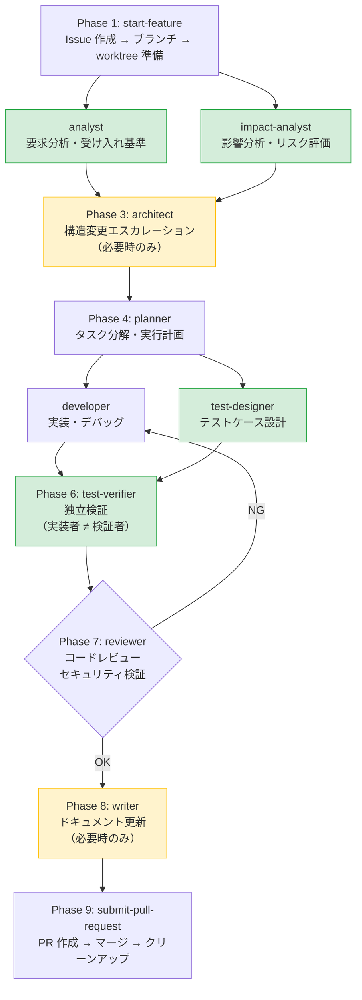

# copilot-cli-workflow-framework

[](LICENSE)
[](https://github.com/nanikasheila/copilot-cli-workflow-framework/stargazers)
[](https://github.com/nanikasheila/copilot-cli-workflow-framework/network)
[](https://github.com/nanikasheila/copilot-cli-workflow-framework/issues)

> **English summary**: A reusable `.github/` framework that powers a **10-agent AI development workflow** using GitHub Copilot CLI. Agents collaborate through a shared Board, enabling parallel execution of read-only agents (analyst + impact-analyst, etc.) and enforcing context isolation between implementers, test designers, and verifiers. Drop-in ready — copy `.github/` to your project and run `initialize-project`.

---

GitHub Copilot CLI で**マルチエージェント開発ワークフロー**を実現する `.github` 構成フレームワーク。

10 体のエージェントが Board を介して協調し、要求分析 → 設計 → 実装 → テスト設計 → 独立検証 → レビュー → ドキュメント → PR の一連のフローを自動化します。読み取り専用エージェントの**並列実行**と**コンテキスト分離**による品質保証が特徴です。

> **VS Code 拡張機能版**: [copilot-workflow-framework](https://github.com/nanikasheila/copilot-workflow-framework)
> — 同じ思想の VS Code 版です。両者の違いは[比較テーブル](#cli-vs-vs-code-拡張機能)を参照してください。

---

## CLI vs VS Code 拡張機能

| 観点 | CLI 版（本リポジトリ） | VS Code 拡張機能版 |
|---|---|---|
| **コンテキスト** | `task` ツールで各エージェントを**別コンテキストウィンドウ**で実行。結果（サマリ）のみ親に返す | 全エージェントが **1 つのコンテキスト**を共有 |
| **並列実行** | 読み取り専用エージェントを**同時実行可能**（analyst + impact-analyst 等） | 逐次実行のみ |
| **Rules 適用** | 自動ロード**されない**。各エージェントが `view` で手動参照 | `applyTo` パターンで**自動適用** |
| **Prompts** | **廃止** — 全プロンプトを **Skills に移行**済み | `/` スラッシュコマンドで利用可能 |
| **Board ミラー** | JSON（永続的正本）+ **SQL ミラー**（セッション内クエリ層） | JSON のみ |
| **エージェント数** | **10 体**（分析・テスト設計・検証を専門エージェントに分離） | 6 体 |
| **品質保証** | 「実装者 ≠ テスト設計者 ≠ 検証者」をコンテキスト分離で**強制** | 同一コンテキスト内で分離 |

---

## 構造

`.github/` は **Instructions・Rules・Skills・Agents** の **4 層** + **Board（ランタイム）** で構成されています。

| 層 | 適用方式 | 役割 |
|---|---|---|
| **Instructions** | ファイルパターンで自動適用 | 言語別・テスト用のコーディングガイドライン |
| **Rules** | 各エージェントが `view` で手動参照 | ブランチ命名・コミット形式・ワークフロー規則 |
| **Skills** | タスクに応じて自動ロード（13 個） | ワークフロー手順の定義（Issue 作成、PR 提出 等） |
| **Agents** | `task` ツールで呼び出し（10 体） | 専門的な役割を持つカスタムエージェント |
| **Board** | ランタイム（`.copilot/boards/`） | Feature 単位の状態管理・エージェント間連携の媒体 |

### ディレクトリツリー

```
.github/
├── copilot-instructions.md       # トップレベル Copilot 設定
├── settings.json                 # プロジェクト固有設定
├── settings.schema.json          # settings.json のスキーマ
├── board.schema.json             # Board JSON スキーマ（コア構造）
├── board-artifacts.schema.json   # Board artifact 定義（成果物スキーマ）
├── gate-profiles.schema.json     # Gate Profile スキーマ
│
├── agents/                       # カスタムエージェント（10 体）
│   ├── analyst.agent.md          #   要求分析・受け入れ基準策定
│   ├── architect.agent.md        #   構造設計・設計判断
│   ├── assessor.agent.md         #   プロジェクト全体評価
│   ├── developer.agent.md        #   実装・デバッグ
│   ├── impact-analyst.agent.md   #   影響分析・依存グラフ・リスク評価
│   ├── planner.agent.md           #   タスク分解・計画策定
│   ├── reviewer.agent.md         #   コードレビュー・品質・セキュリティ検証
│   ├── test-designer.agent.md    #   テストケース設計
│   ├── test-verifier.agent.md    #   テスト検証・品質判定
│   └── writer.agent.md           #   ドキュメント・リリース管理
│
├── instructions/                 # ファイルパターン別ガイドライン（自動適用）
│   ├── common.instructions.md
│   ├── javascript.instructions.md
│   ├── typescript.instructions.md
│   ├── python.instructions.md
│   └── test.instructions.md
│
├── rules/                        # 開発ルール（手動参照）
│   ├── development-workflow.md
│   ├── workflow-state.md
│   ├── gate-profiles.json
│   ├── branch-naming.md
│   ├── commit-message.md
│   ├── merge-policy.md
│   ├── worktree-layout.md
│   ├── issue-tracker-workflow.md
│   └── error-handling.md
│
├── skills/                       # ワークフロースキル（13 個）
│   ├── analyze-and-plan/
│   ├── assess-project/
│   ├── cleanup-worktree/
│   ├── configure-model/
│   ├── generate-gitignore/
│   ├── initialize-project/
│   ├── manage-board/
│   ├── merge-nested-branch/
│   ├── orchestrate-workflow/
│   ├── resolve-conflict/
│   ├── review-code/
│   ├── start-feature/
│   └── submit-pull-request/
│
└── workflows/
    └── ci.yml                    # CI ワークフロー
```

### docs/（ドキュメント）

```
docs/
├── quickstart.md                 # クイックスタートガイド
└── architecture/                 # 構造ドキュメント（architect/writer が維持）
    ├── module-map.md             #   ディレクトリごとの責務・層の対応・依存方向
    ├── data-flow.md              #   主要データの流れ・Source of Truth
    ├── design-philosophy.md      #   設計思想
    ├── glossary.md               #   ドメイン固有の用語定義
    └── adr/                      #   設計判断記録（ADR-001, ADR-002, ...）
```

### tools/（フレームワーク外ツール）

```
tools/
├── skill-creator/                # スキル作成ガイド（独立ツール）
├── validate-github-config/       # .github 設定のバリデーション
└── validate-schemas/             # スキーマ整合性バリデーション
```

---

## エージェント

トップレベルの Copilot CLI が**オーケストレーター**として機能し、Board を管理しながら `task` ツールで各エージェントを呼び出します。

| エージェント | 役割 | 並列安全 | 備考 |
|---|---|---|---|
| `analyst` | 要求分析・受け入れ基準策定 | ✅ | 読み取り専用。impact-analyst と並列実行可能 |
| `impact-analyst` | 影響分析・依存グラフ・リスク評価 | ✅ | 読み取り専用。analyst と並列実行可能 |
| `architect` | 構造設計・設計判断 | — | エスカレーション時のみ呼び出し |
| `planner` | タスク分解・計画策定 | — | analyst + impact-analyst の結果を入力として受け取る |
| `developer` | 実装・デバッグ | — | 書き込み系。test-designer と並列実行可能 |
| `test-designer` | テストケース設計 | ✅ | 読み取り専用。要求ベースで設計（実装に依存しない） |
| `test-verifier` | テスト検証・品質判定 | ✅ | 実装者と独立した立場で検証 |
| `reviewer` | コードレビュー・品質・セキュリティ検証 | ✅ | セキュリティ観点を常時チェック |
| `writer` | ドキュメント・リリース管理 | — | 技術文書・リリースノート・バージョニング |
| `assessor` | プロジェクト全体評価 | — | 移植直後の包括評価。コード変更は行わない |

> **並列安全（✅）**: 読み取り専用のためファイル競合なく同時実行可能。CLI の `task` ツールで並列呼び出しできます。

---

## スキル

スキルはワークフローの手順を定義するもので、ユーザーの指示やコンテキストに応じて自動的にロードされます。

| スキル | 用途 |
|---|---|
| `start-feature` | Issue 作成・ブランチ・worktree 準備で新規作業を開始 |
| `analyze-and-plan` | 要求分析（analyst）・影響分析（impact-analyst）・計画策定（planner）を連携実行 |
| `orchestrate-workflow` | Feature 開発フロー全体のオーケストレーション手順 |
| `manage-board` | Board の CRUD・状態遷移・Gate 評価・アーカイブ |
| `review-code` | コードレビュー実行・修正委任 |
| `submit-pull-request` | 変更のコミット・PR 作成・マージ |
| `cleanup-worktree` | マージ後の worktree・ブランチ・Issue 整理 |
| `assess-project` | プロジェクト全体の包括的評価 |
| `configure-model` | エージェントの LLM モデル変更 |
| `initialize-project` | 新規プロジェクトの `.github/` 初期設定 |
| `generate-gitignore` | gitignore.io API を使った `.gitignore` 生成 |
| `resolve-conflict` | PR マージ時のコンフリクト解消 |
| `merge-nested-branch` | 入れ子ブランチ構造の順序マージ（サブ → 親 → main） |

---

## 開発フロー

`orchestrate-workflow` スキルが定義する 9 フェーズの開発フローです。読み取り専用エージェントは並列実行されます。



> 🟢 **並列実行可能**（読み取り専用）　🟡 **必要時のみ呼び出し**

### Board によるエージェント間連携

エージェント間の状態共有は **Board**（`.copilot/boards/<feature-id>/board.json`）を通じて行われます。

- **JSON が永続的正本** — Feature 単位で作成され、状態・成果物・Gate 評価結果を保持
- **SQL ミラー** — CLI の `sql` ツールで Board JSON のセッション内コピーを維持し、高速クエリを実現
- **Gate 評価** — フェーズ遷移時に品質基準を自動チェック（`gate-profiles.json` で定義）

詳細は `rules/development-workflow.md` および `rules/workflow-state.md` を参照。

---

## 使い方

### 1. 導入

```bash
# .github/ をプロジェクトにコピー
cp -r path/to/copilot-cli-workflow-framework/.github your-project/.github
```

### 2. 初期設定

```bash
# プロジェクトディレクトリで Copilot CLI を起動
cd your-project
copilot
```

`initialize-project` スキルが対話的に設定をガイドします。手動で `settings.json` を編集することも可能です。

### 3. 開発を開始

```
# 新しい Feature を始める（自然言語で指示）
> ログイン機能を追加したい

# start-feature → analyze-and-plan → orchestrate-workflow が連携して動作
```

### 主要なスキル呼び出し例

| やりたいこと | 指示例 |
|---|---|
| 新機能の開発開始 | `ユーザー認証機能を追加して` |
| プロジェクト評価 | `このプロジェクトの状態を評価して` |
| コードレビュー | `変更をレビューして` |
| PR 提出 | `PR を作成してマージして` |
| worktree 整理 | `マージ済みの worktree を片付けて` |

> **初めての方へ**: 詳細なウォークスルーは [docs/quickstart.md](docs/quickstart.md) を参照してください。

---

## ツール利用ポリシー

| ツール | 必須度 | 備考 |
|---|---|---|
| Git | **必須** | すべての変更は Git で管理 |
| GitHub | **推奨** | PR・マージ・コードレビューに使用 |
| Issue トラッカー | **オプション** | Linear / GitHub Issues に対応。`settings.json` で `provider: "none"` に設定すると無効化 |

---

## FAQ

### Q: VS Code 版とどちらを使えばよいですか？

**Copilot CLI** を使っている場合は本リポジトリを、**VS Code Copilot Chat** を使っている場合は [VS Code 版](https://github.com/nanikasheila/copilot-workflow-framework)を使ってください。CLI 版は並列実行とコンテキスト分離による品質保証に強みがあります。

### Q: Rules が自動適用されないのはなぜですか？

CLI の仕様上、`rules/` ディレクトリは自動ロードされません。各エージェントの定義ファイル内で必要なルールを `view` で参照する設計になっています。これは CLI 版の制約ですが、「必要なルールだけを読み込む」ことでコンテキストウィンドウを効率的に使うメリットもあります。

### Q: Prompts（スラッシュコマンド）はどこにありますか？

**廃止されました。** CLI ではプロンプトファイルが使えないため、すべてのプロンプトを **Skills** に移行済みです。自然言語で指示すれば、対応するスキルが自動的にロードされます。

### Q: Board とは何ですか？

Feature 単位の状態管理ファイル（`.copilot/boards/<feature-id>/board.json`）です。エージェント間で作業状態・成果物・Gate 評価結果を共有するために使われます。JSON が永続的な正本で、セッション中は SQL ミラーで高速にクエリできます。

### Q: 既存プロジェクトに導入するには？

`.github/` をコピーした後、`initialize-project` スキルを使って対話的に `settings.json` を設定してください。その後、`assess-project` スキルでプロジェクトの現状を評価するのがおすすめです。

---

## ライセンス

MIT
